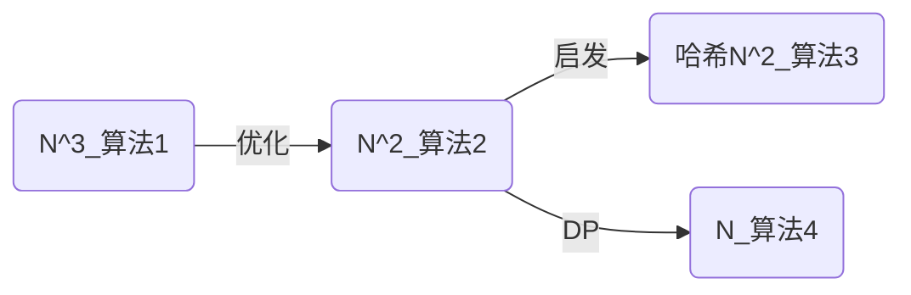

## [2023 CSP-S T2]消消乐
### 解法关系图

### 算法一 (35pts)

枚举每一个子串，用栈判断子串是否合法，预计 $35pts$。
```cpp
#include <bits/stdc++.h>
#define int long long
using namespace std;
int n;
char a[2000005];
int ans;
signed main() {
    ios::sync_with_stdio(0);
    cin.tie(0);
    cin >> n;
    cin >> a + 1;
    for(int i = 1; i <= n - 1; i++) {
        for(int j = i + 1; j <= n; j++) {
            if((j - i + 1) % 2) continue; // 如果这个子串有奇数个元素那么一定不是合法的
            stack<pair<int, int> > st;
            for(int k = i; k <= j; k++) {
                if(!st.empty() && st.top().first == a[k] - 'a') st.pop();
                else st.push(make_pair(a[k] - 'a', k));
            }
            if(st.size() == 0) ans++;
        }
    }
    cout << ans << '\n';
    return 0;
} 
```
### 算法2 (50pts)

注意到并不需要枚举每个子串，**每个子串必定是以该子串的首为首的串的子串**。所以枚举每个前缀 $i$ ，用栈在 $i$ ~ $n$ 上匹配。

- 若在匹配到 $j$ 时栈空，证明 $a[i]$ ~ $a[j]$ 是合法子串，记录即可。

预计 $50pts$。
```cpp
#include <bits/stdc++.h>
#define int long long
using namespace std;
int n;
char a[2000005];
int ans;
signed main() {
	ios::sync_with_stdio(0);
	cin.tie(0);
	cin >> n;
	cin >> a + 1;
	for(int i = 1; i <= n; i++) {
		stack<pair<int, int> > st;
		for(int j = i; j <= n; j++) {
			if(!st.empty() && st.top().first == a[j] - 'a') st.pop();
			else st.push(make_pair(a[j] - 'a', j));
			if(st.size() == 0) ans++;
		}
	}
	cout << ans << '\n';
	return 0;
}
```

### 算法3 (100pts)

### 算法4 (100pts)


<!--stackedit_data:
eyJoaXN0b3J5IjpbNzc1MTY1NTAwXX0=
-->