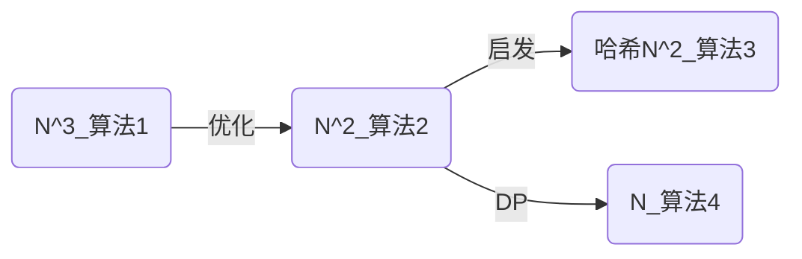

## [2023 CSP-S T2]消消乐
### 解法关系图

### 算法一 (35pts)

枚举每一个子串，用栈判断子串是否合法，预计 $35pts$。
```cpp
#include <bits/stdc++.h>
#define int long long
using namespace std;
int n;
char a[2000005];
int ans;
signed main() {
    ios::sync_with_stdio(0);
    cin.tie(0);
    cin >> n;
    cin >> a + 1;
    for(int i = 1; i <= n - 1; i++) {
        for(int j = i + 1; j <= n; j++) {
            if((j - i + 1) % 2) continue; // 如果这个子串有奇数个元素那么一定不是合法的
            stack<pair<int, int> > st;
            for(int k = i; k <= j; k++) {
                if(!st.empty() && st.top().first == a[k] - 'a') st.pop();
                else st.push(make_pair(a[k] - 'a', k));
            }
            if(st.size() == 0) ans++;
        }
    }
    cout << ans << '\n';
    return 0;
} 
```
### 算法2 (50pts)

注意到并不需要枚举每个子串，**每个子串必定是以该子串的首为首的串的子串**。所以枚举每个前缀 $i$ ，用栈在 $i$ ~ $n$ 上匹配。

- 若在匹配到 $j$ 时栈空，证明 $a[i]$ ~ $a[j]$ 是合法子串，记录即可。

预计 $50pts$。
```cpp
#include <bits/stdc++.h>
#define int long long
using namespace std;
int n;
char a[2000005];
int ans;
signed main() {
	ios::sync_with_stdio(0);
	cin.tie(0);
	cin >> n;
	cin >> a + 1;
	for(int i = 1; i <= n; i++) {
		stack<pair<int, int> > st;
		for(int j = i; j <= n; j++) {
			if(!st.empty() && st.top().first == a[j] - 'a') st.pop();
			else st.push(make_pair(a[j] - 'a', j));
			if(st.size() == 0) ans++;
		}
	}
	cout << ans << '\n';
	return 0;
}
```

### 算法3 (100pts)
摘编自[洛谷题解](https://www.luogu.com.cn/article/muvjfo8y)

首先考虑一个串可以被消除时的结构：

-   $xx$  可以被消除。
-   若  $A$  和  $B$  均可以被消除，则  $AB$  也可以被消除。
-   若  $A$  可以被消除，则  $xAx$  也可以被消除。

观察到这个东西跟“合法括号序列”的定义很像，所以我们考虑枚举左端点，然后移动右端点，开个栈去膜你，就得到了一个  $O(n^2)$ 的做法。

进一步的，考虑我们固定左端点为  1，当右端点移动到  $k$  时，当前栈里元素为  $S$；当右端点移动到  $k′$  时，栈里元素再一次变成  $S$。那么说明了什么？也就是说，**$[k+1,k′]$  范围内的字符串被完全消除了**。

但其实这样子讲也不是很准确。

比如：字符串为  $aaa$，$S3​=S1​=a$，但是在我们膜你过程中，第  2  个  $a$  明明是和第  1  个  $a$  消除了，但是在我们的意思中，他似乎是和第  3  个  $a$  消除了，这样子不会多记/少记吗？

实际上并不会。感性理解一下，如果说我们加入了几个字符，把原来栈顶的几个元素给消掉了，那么我们要再加入几个字符，使得加入后得到的新栈和原来栈相等，那说明了什么？**说明了加入的几个字符和消掉的几个字符是相等的**。也就是新加入的所有字符可以互相抵消。

那么我们时时维护一个栈，每加入一个字符后计算一下其哈希值（可以时时维护），然后丢到一个  `map`  里，并且查一下  `map`  里有几个跟他相同的。

然后就做完了，复杂度  $O(nlogn)$，如果用  `unordered_map`  代替  `map`，理论上可以做到  $O(n)$。

### 算法4 (100pts)


<!--stackedit_data:
eyJoaXN0b3J5IjpbLTE5MjUyNjMzMjZdfQ==
-->